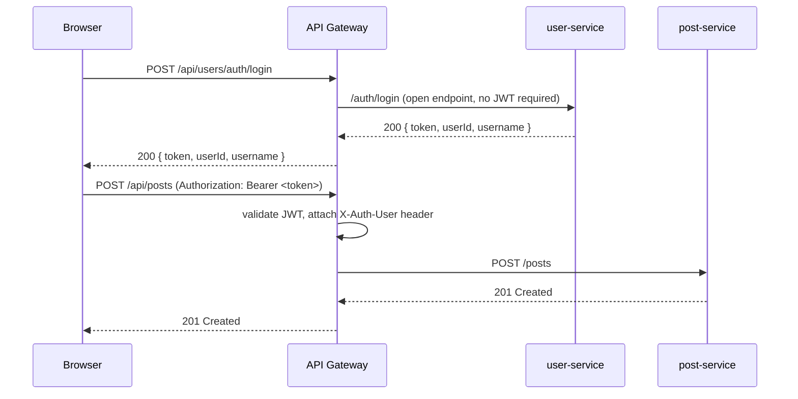
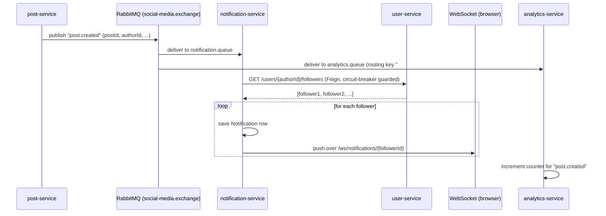

# Architecture

## 1. Design goals

The platform's technical requirements (from the task brief) drove every
decision below:

- Create 6+ independent microservices
- Service discovery with Eureka
- API Gateway for routing
- Inter-service communication (synchronous via Feign + circuit breakers,
  asynchronous via RabbitMQ)
- Message queue with RabbitMQ for event-driven fan-out
- Containerize all services with Docker
- Distributed configuration (per-service `application.yml` + Docker/K8s env overrides)
- Circuit breaker pattern for resilience (Resilience4j)
- Centralized logging groundwork (structured logs, ready for an ELK/Loki sidecar)
- Distributed tracing groundwork (Actuator + correlation IDs; see §6)

## 2. Service inventory

| Service | Port | Owns | Responsibility |
|---|---|---|---|
| service-discovery | 8761 | — | Eureka registry; every other service registers here |
| api-gateway | 8080 | — | Single entry point, JWT validation, routing, CORS |
| user-service | 8081 | `userdb` | Registration, login (JWT issuance), profiles, follow graph |
| post-service | 8082 | `postdb` | Posts, likes, comments; **publishes** `post.created` |
| notification-service | 8083 | `notificationdb` | **Consumes** `post.created`; resolves followers via Feign; pushes over WebSocket |
| chat-service | 8084 | `chatdb` | Real-time 1:1 messaging over WebSocket; persists history |
| media-service | 8085 | local/object storage | Image/video upload, validation, serving |
| analytics-service | 8086 | `analyticsdb` | **Consumes every event** (`#` routing key); aggregates platform stats |

Each service has its own database — the **database-per-service** pattern —
so services can evolve their schemas independently and no service can
accidentally couple to another's internal table structure.

## 3. Request flow (synchronous, via the gateway)

## 4. Event-driven flow (asynchronous, via RabbitMQ)

This is the platform's core "real-time notification" feature, and mirrors
the sample code given in the task brief almost line for line.

If `user-service` is temporarily unreachable, the Resilience4j circuit
breaker on `NotificationService.getFollowersSafely()` opens and the
fallback (`followersFallback`) simply skips fan-out for that event instead
of blocking or crashing the consumer — the notification pipeline degrades
gracefully rather than failing hard.

## 5. Resilience patterns

| Pattern | Where | Behavior |
|---|---|---|
| Circuit breaker | `post-service` → RabbitMQ publish | If the broker is down, `publishFallback` logs and lets post creation succeed anyway (availability over strict consistency) |
| Circuit breaker | `notification-service` → `user-service` (Feign) | If user-service is down, notification fan-out is skipped for that event rather than blocking the consumer thread |
| Health checks | every service | Spring Boot Actuator `/actuator/health`, used by Docker Compose `depends_on: condition: service_healthy` and Kubernetes readiness/liveness probes |
| Horizontal autoscaling | Kubernetes | Each business microservice has a `HorizontalPodAutoscaler` scaling 2→6 replicas on 70% CPU |
| Load balancing | API Gateway | Spring Cloud LoadBalancer round-robins across all healthy instances registered in Eureka for a given service name |

## 6. CAP theorem / eventual consistency notes

The notification and analytics pipelines are **eventually consistent** by
design: a post is durably created (strongly consistent write to `postdb`)
before the `post.created` event is even published, so a temporary RabbitMQ
outage never loses a post — it only delays (or, with the circuit breaker
open, skips) the *derived* side effects (notifications, analytics counters).
This is a deliberate **availability-over-consistency** choice (AP over CP,
per CAP theorem) appropriate for a social feed, where "you found out about
a new post 5 seconds late" is an acceptable trade-off and "the post failed
to save because a queue was down" is not.

## 7. Distributed tracing & centralized logging (groundwork)

Full distributed tracing (e.g., Zipkin/Jaeger via Micrometer Tracing) and
centralized log aggregation (ELK/Loki) are natural next steps and are
called out explicitly as extensions rather than implemented in full here,
to keep the reference implementation focused. The groundwork is in place:

- Every service exposes Actuator (`/actuator/health`, `/actuator/info`,
  `/actuator/circuitbreakers`), which is the same dependency tracing starters
  build on.
- `docs/`/`monitoring/prometheus.yml` shows how to wire in metrics scraping;
  adding `micrometer-tracing-bridge-brave` + a Zipkin exporter to each `pom.xml`
  is the remaining step for full request tracing across service boundaries.

## 8. Why Context API + `useReducer` instead of Redux?

The task brief calls for "React advanced state management" — Context API
with `useReducer` gives the same predictable, action-based state updates
Redux popularized, without an extra dependency, which is appropriate for a
learning project of this size. `SocialMediaContext.js` follows exactly the
reducer/action shape shown in the task's own sample code
(`FETCH_POSTS_REQUEST` / `FETCH_POSTS_SUCCESS` / `ADD_POST` / `ADD_NOTIFICATION`).
